<div align="center">

# 🛡️ SAMPAARK

### Privacy-First Vehicle Identity & Emergency Communication Platform

[](https://nodejs.org/)
[](https://reactjs.org/)
[](https://www.mongodb.com/)
[](https://exotel.com/)
[](https://payu.in/)

**Replace your dashboard phone number with a cryptographically signed QR code.**
Anyone scans it → Calls, SMS, or Emergency — without ever seeing your real number.

[🚀 Getting Started](#-getting-started) · [📐 Architecture](#-system-architecture) · [🔄 User Flows](#-user-flows) · [🛠️ API Reference](#%EF%B8%8F-api-reference)

</div>

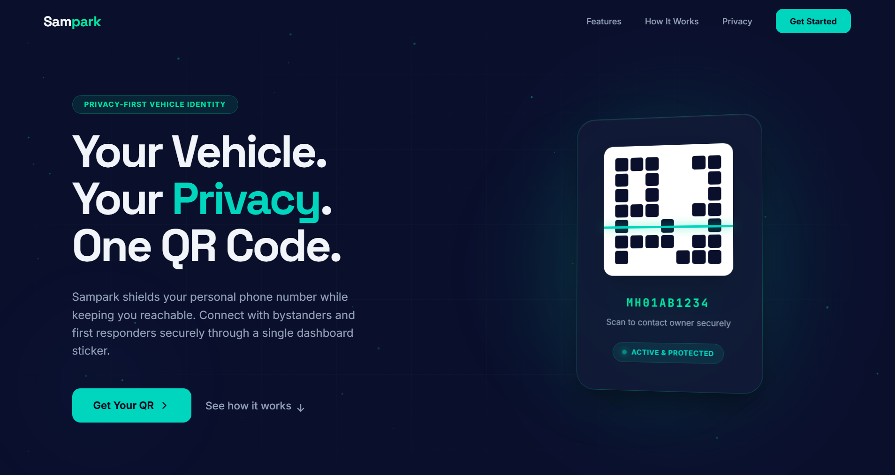


---

## 🚨 The Problem

170 million vehicles in India display owner phone numbers on their dashboards — creating vectors for spam, stalking, harassment, and social engineering. But removing the number means nobody can reach you in a parking emergency.

**The paradox:** You *need* to be reachable for your parked vehicle, but displaying your number makes you vulnerable.

---

## 💡 The Solution

Sampaark replaces your dashboard number with a QR code enabling masked communication — neither party ever sees the other's real phone number.


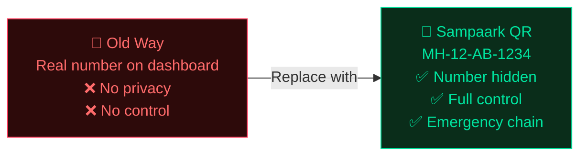

**How it works:** Sign up → verify vehicle docs → pay ₹499/year → get a signed QR for your dashboard. Anyone scans it with any camera — no app needed — and can Call, SMS, or raise an Emergency, all masked.

---

## ✨ Key Features

| For Vehicle Owners | For QR Scanners | For Admins |
|---|---|---|
| 🔒 Masked calls & SMS via Exotel | 📱 No app required — any browser | 📈 Analytics with Recharts |
| 🚨 Emergency call chain (owner → EC1 → EC2 → EC3 → SMS) | 📞 One-tap masked call | 🚩 Abuse management + auto-moderation |
| 🎛️ Comm modes: All / Message Only / Silent | 💬 Pre-written SMS templates | 🎫 Full support ticketing |
| 📊 Activity dashboard with caller hashes | 🚨 Emergency bypasses all blocks | 📦 Order pipeline management |
| 🛡️ Privacy score 0–100 | 🔁 Call-to-SMS fallback | — |
| 🔄 Secure vehicle transfer (48h code) | — | — |

---

## 📐 System Architecture

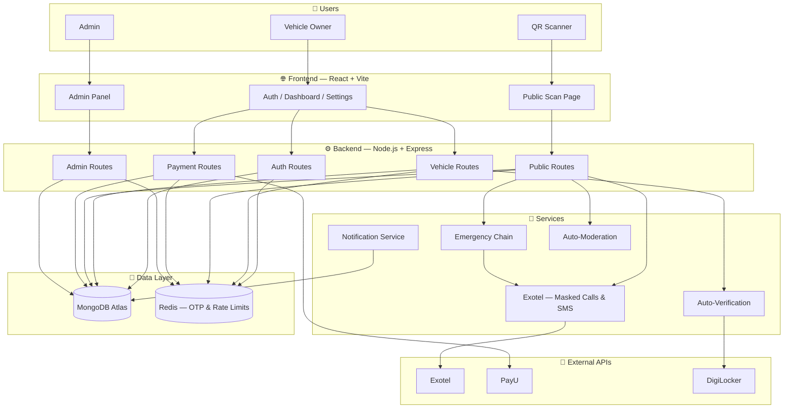

### QR Scan → Masked Call: Request Flow

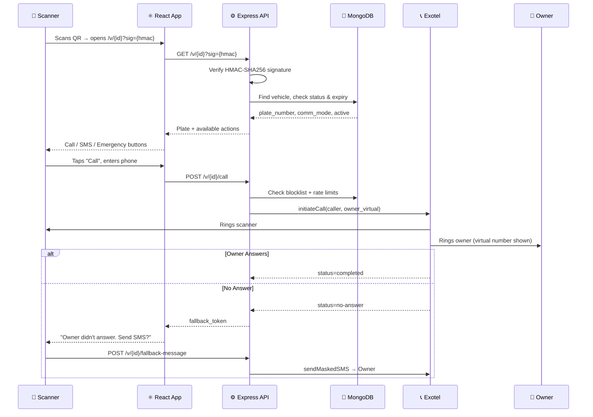

### Emergency Chain Flow

```mermaid
sequenceDiagram
    participant Scanner as 📱 Scanner
    participant Backend as ⚙️ Backend
    participant Exotel as 📞 Exotel
    participant Owner as 👤 Owner
    participant EC1 as 🆘 EC 1
    participant EC2 as 🆘 EC 2

    Scanner->>Backend: POST /v/{id}/emergency { reason, phone }

    rect rgb(80, 20, 20)
        Note over Backend,Owner: Step 1 — Call Owner (30s timeout)
        Backend->>Exotel: Call owner
        Exotel->>Owner: ☎️ Ringing...
        alt Answers
            Owner-->>Backend: ✅ Connected
        else No Answer
            Exotel-->>Backend: ❌ no-answer
        end
    end

    rect rgb(80, 50, 10)
        Note over Backend,EC1: Step 2 — Call EC1 (30s timeout)
        Backend->>Exotel: Call EC1
        Exotel->>EC1: ☎️ Ringing...
        alt Answers
            EC1-->>Backend: ✅ Connected
        else No Answer
            Exotel-->>Backend: ❌ no-answer
        end
    end

    rect rgb(20, 40, 80)
        Note over Backend,EC2: Step 3 — SMS Fallback to Everyone
        Backend->>Exotel: SMS → Owner, EC1, EC2, EC3
        Backend-->>Scanner: "Alert sent to all contacts"
    end
```

---

## 🔧 Tech Stack

| Layer | Technology |
|-------|-----------|
| Frontend | React 18 + Vite, Tailwind CSS, Recharts |
| Backend | Node.js + Express |
| Database | MongoDB Atlas + Mongoose |
| Cache | Redis (ioredis) — OTP & rate limiting |
| Auth | JWT + Phone OTP |
| Telecom | Exotel — masked calls & SMS |
| Payments | PayU — UPI, cards, net banking |
| Verification | DigiLocker API / Basic OCR |
| QR | qrcode (npm) + HMAC-SHA256 signing |
| Encryption | AES-256 (storage) + SHA-256 (lookups) |

---

## 🔄 User Flows

### Registration → Active QR

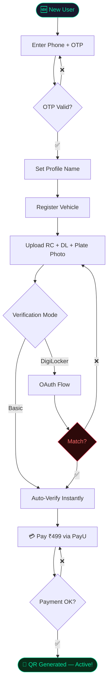

### Public QR Scan — All Paths

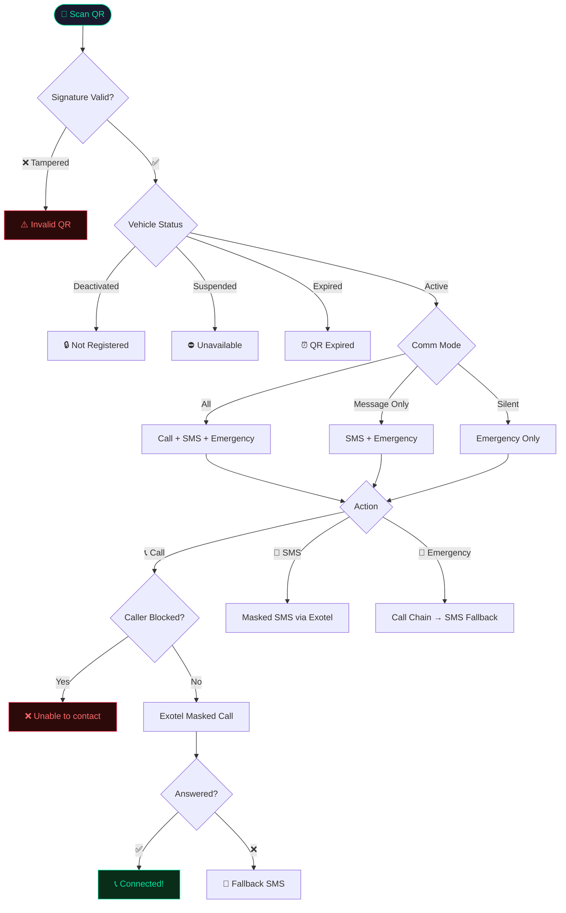

### QR Lifecycle

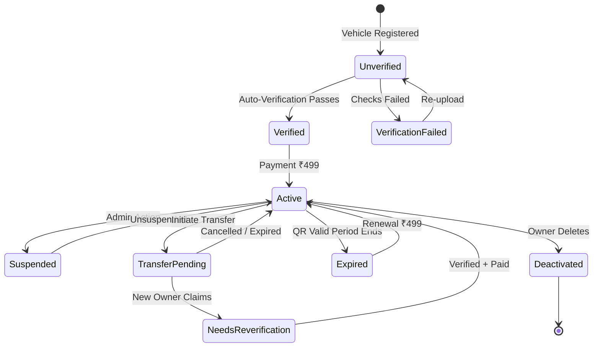

---

## 📊 Data Models

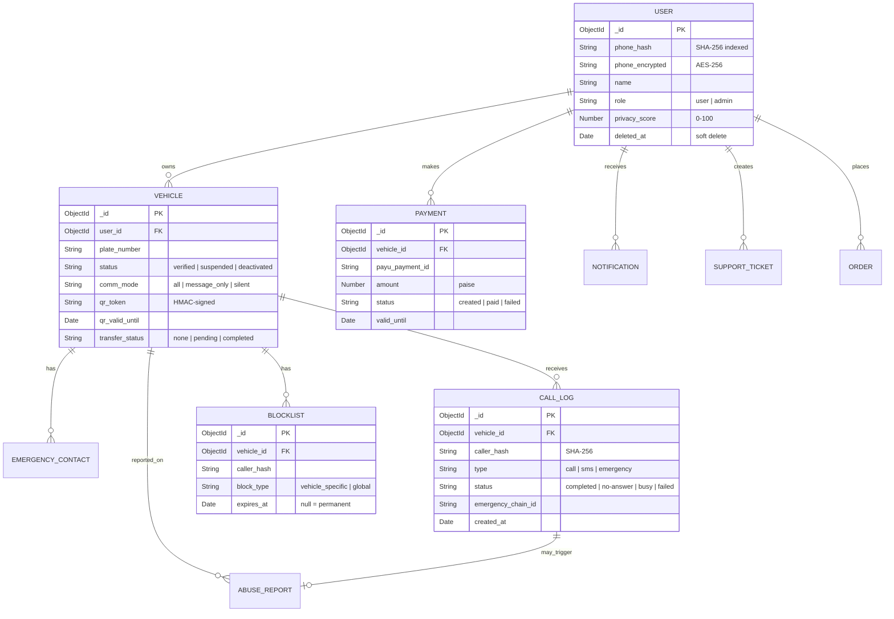

---

## 🛠️ API Reference

### Authentication
| Method | Endpoint | Auth | Description |
|--------|----------|------|-------------|
| `POST` | `/api/v1/auth/send-otp` | ❌ | Send OTP |
| `POST` | `/api/v1/auth/verify-otp` | ❌ | Verify OTP → JWT |
| `GET` | `/api/v1/users/me` | 🔐 | Current user + privacy score |

### Vehicles
| Method | Endpoint | Auth | Description |
|--------|----------|------|-------------|
| `POST` | `/api/v1/vehicles` | 🔐 | Register (multipart: RC, DL, photo) |
| `GET` | `/api/v1/vehicles` | 🔐 | List user's vehicles |
| `GET` | `/api/v1/vehicles/:id` | 🔐 | Detail with call logs |
| `POST` | `/api/v1/vehicles/:id/transfer/initiate` | 🔐 | Start transfer → 48h code |
| `POST` | `/api/v1/vehicles/transfer/claim` | 🔐 | Claim with transfer code |
| `DELETE` | `/api/v1/vehicles/:id` | 🔐 | Soft-delete |

### Public (QR Scan — No Auth)
| Method | Endpoint | Description |
|--------|----------|-------------|
| `GET` | `/api/v1/v/:id` | Validate QR, return plate + comm_mode |
| `POST` | `/api/v1/v/:id/call` | Initiate masked call |
| `POST` | `/api/v1/v/:id/sms` | Send masked SMS |
| `POST` | `/api/v1/v/:id/emergency` | Trigger emergency chain |
| `GET` | `/api/v1/v/:id/emergency-status/:chainId` | Poll chain progress |
| `POST` | `/api/v1/v/:id/fallback-message` | SMS after missed call |
| `POST` | `/api/v1/v/:id/report` | Report QR/vehicle issue |

### Payments
| Method | Endpoint | Auth | Description |
|--------|----------|------|-------------|
| `POST` | `/api/v1/payments/create-order` | 🔐 | Create PayU order |
| `POST` | `/api/v1/payments/verify` | 🔐 | Verify signature → generate QR |
| `POST` | `/api/v1/payments/renew` | 🔐 | Renewal order |

### Admin
| Method | Endpoint | Auth | Description |
|--------|----------|------|-------------|
| `GET` | `/api/v1/admin/analytics` | 👑 | Full analytics |
| `GET/PUT` | `/api/v1/admin/abuse-reports/:id` | 👑 | Review + action |
| `GET/DELETE` | `/api/v1/admin/blocklist/:id` | 👑 | Manage blocks |
| `PUT` | `/api/v1/admin/suspended-vehicles/:id/unsuspend` | 👑 | Unsuspend |
| `GET/PUT` | `/api/v1/admin/orders/:id` | 👑 | Order pipeline |
| `GET/POST/PUT` | `/api/v1/admin/support/:id` | 👑 | Support tickets |

### Webhooks
| Method | Endpoint | Description |
|--------|----------|-------------|
| `POST` | `/api/v1/webhooks/exotel` | Call status → triggers fallback chain |
| `POST` | `/api/v1/webhooks/payu` | Payment status updates |

> 🔐 JWT Bearer required · 👑 Admin role required · ❌ Public

---

## 🔒 Security Architecture

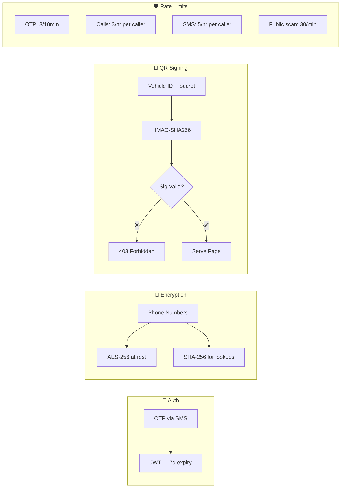

| Layer | Measure |
|-------|---------|
| Transport | HTTPS enforced |
| Auth | JWT + OTP — phone-verified only |
| Phone Storage | AES-256 encrypted + SHA-256 hashed |
| QR URLs | HMAC-SHA256 signed, server-validated |
| Public Page | Zero PII — only plate number shown |
| Compliance | DPDP Act: data export, soft deletes, anonymized logs |

---

## 🚀 Getting Started

### Prerequisites
- Node.js 18+, MongoDB (Atlas free tier), Redis, Exotel account, PayU account

```bash
git clone https://github.com/yourusername/sampaark.git

# Backend
cd server && npm install && cp .env.example .env && npm run dev

# Frontend
cd client && npm install && cp .env.example .env && npm run dev
```

### Mock Mode (Dev)
Set `MOCK_CALLS=true` in `.env`:
- Phones ending in `0` → no-answer, `1` → busy, others → connected
- Emergency chain simulates full cascade with 3s delays
- PayU test card: `4111 1111 1111 1111`, OTP: `1234`

---

## ⚙️ Environment Variables

```env
# Server
PORT=5000
NODE_ENV=development
MONGO_URI=mongodb+srv://...
JWT_SECRET=min_32_chars
ENCRYPTION_KEY=exactly_32_chars
QR_SECRET=your_hmac_secret
REDIS_URL=redis://localhost:6379

# Exotel
EXOTEL_API_KEY=...
EXOTEL_API_TOKEN=...
EXOTEL_SID=...
EXOTEL_VIRTUAL_NUMBER=...
MOCK_CALLS=true

# PayU
PAYU_KEY=...
PAYU_SALT=...
PAYU_BASE_URL=https://test.payu.in

# Frontend URL
FRONTEND_URL=http://localhost:5173
```

```env
# client/.env
VITE_API_URL=http://localhost:5000/api/v1
VITE_PAYU_KEY=your_merchant_key
```

---

## 📁 Project Structure

```
sampaark/
├── server/
│   ├── models/          # User, Vehicle, CallLog, EmergencyContact, Payment...
│   ├── routes/          # auth, vehicles, public, payments, admin, webhooks
│   ├── middleware/       # auth.js, adminAuth.js, errorHandler.js
│   ├── services/        # exotel, emergencyChain, notificationService, autoModeration
│   ├── utils/           # otp, qr, encryption, privacyScore, analytics
│   └── index.js
└── client/
    └── src/
        ├── pages/       # Login, Dashboard, RegisterVehicle, PublicScan, Settings, admin/*
        ├── components/  # QRCard, PrivacyScore, PaymentButton, InstallPrompt
        ├── layouts/     # AdminLayout
        └── api/         # axios.js with JWT interceptor
```

---

## 💰 Revenue Model

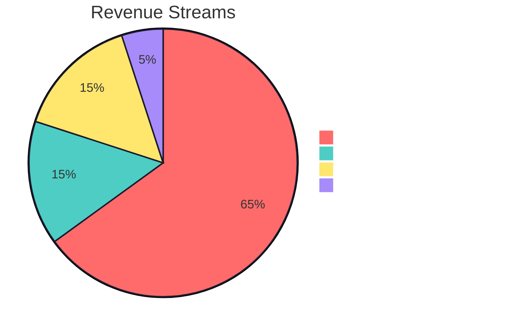

| Stream | Price | Model |
|--------|-------|-------|
| QR Subscription | ₹499/year/vehicle | Recurring — primary |
| Physical Card | ₹99 standard / ₹199 express | One-time |
| B2B Fleet | Custom | Gated communities, corporate |
| Premium (future) | TBD | Multi-language, priority support |

---

## 🗺️ Roadmap

**v1.0 — Complete**
OTP auth · Vehicle registration + document upload · Auto-verification · PayU payments · HMAC-signed QR · Masked calls & SMS via Exotel · Emergency call chain · QR expiry & renewal · Print + physical card ordering · Notification center · Privacy score · Admin analytics · Abuse management + auto-moderation · Support ticketing · PWA

**v2.0 — Planned**
DigiLocker production integration · Push notifications (Firebase) · Multi-language (Hindi + regional) · B2B fleet dashboard · WhatsApp Business API · AI abuse pattern detection · Insurance/toll integrations

---

<div align="center">

**Built with 🛡️ privacy in mind**

*Sampaark — Because your phone number shouldn't be public just because your car is parked.*

</div>
