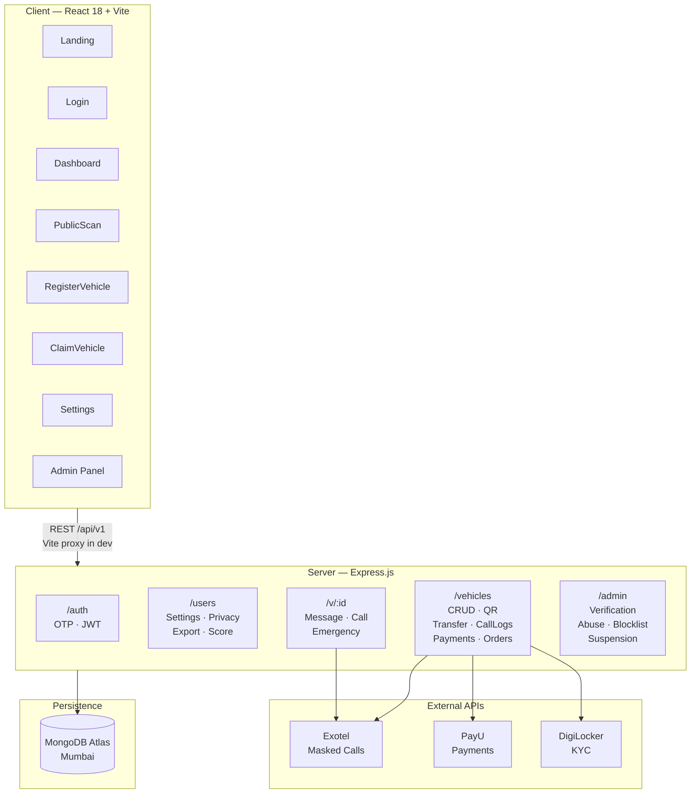
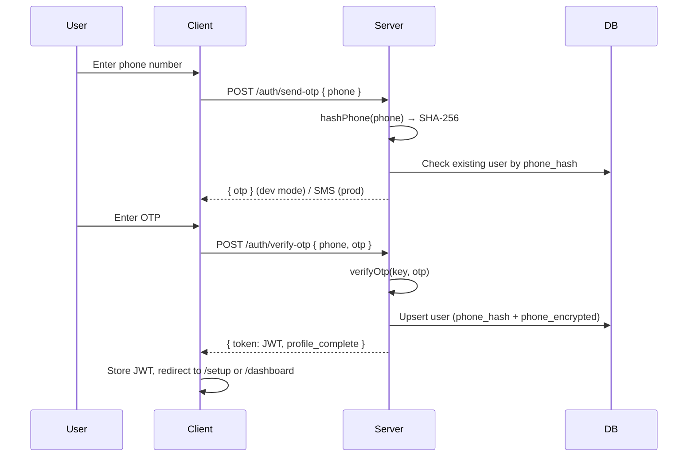
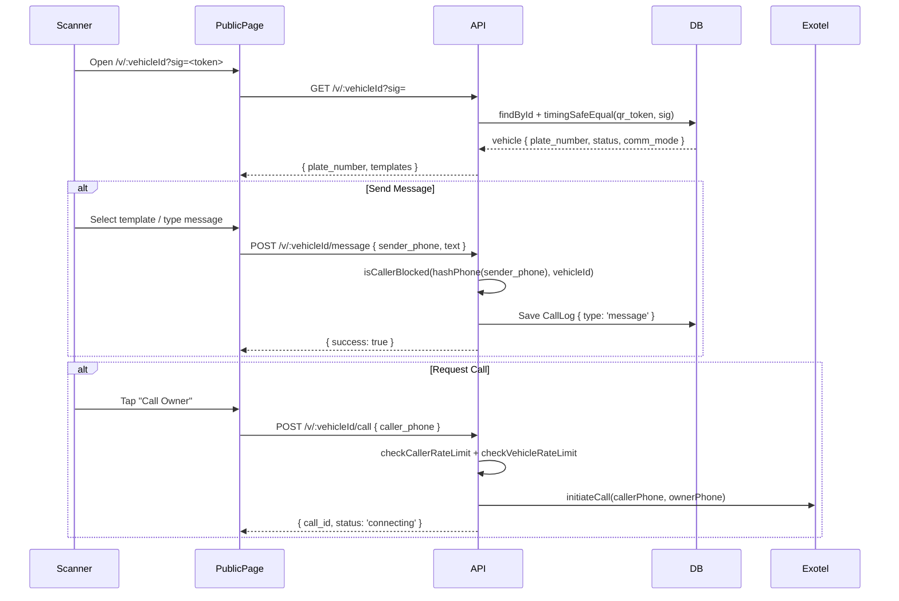
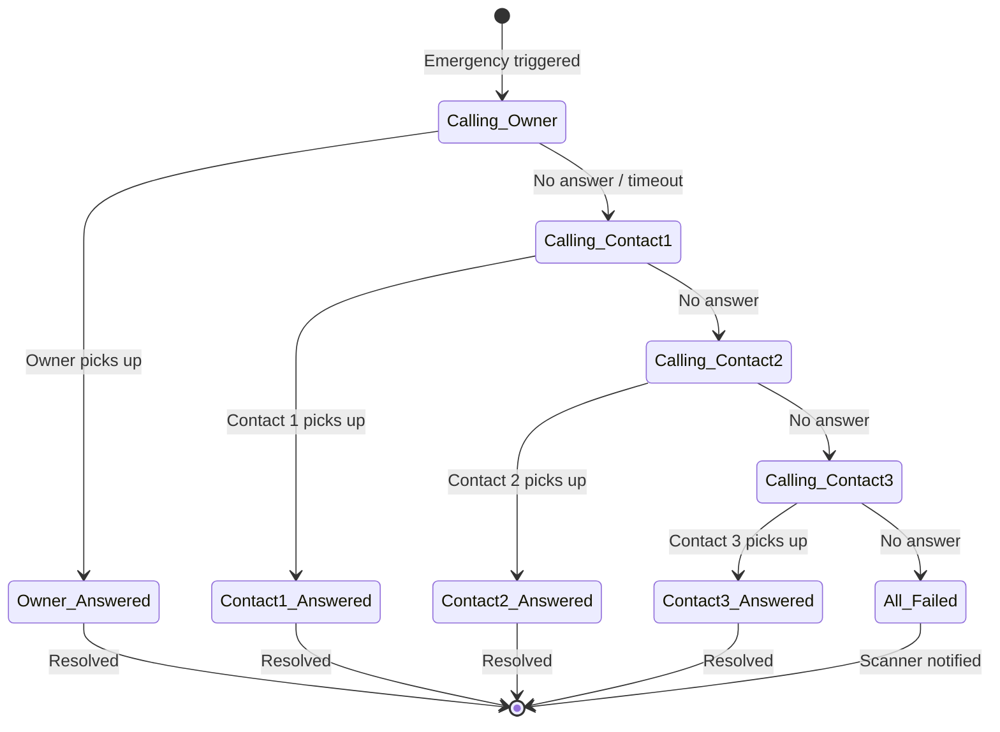
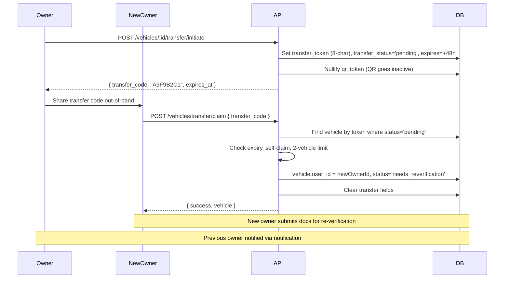
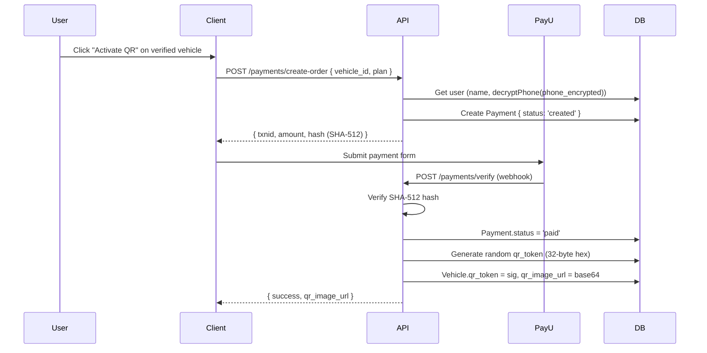
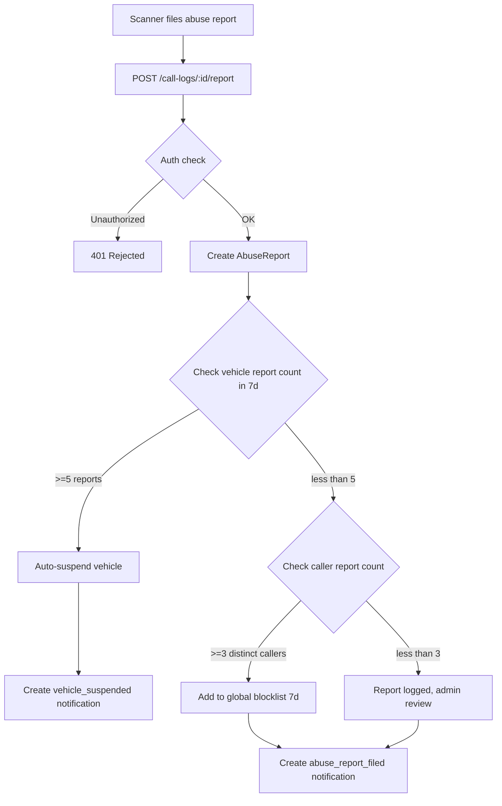

<div align="center">

# Sampark — Privacy-First Vehicle Identity Platform

**Connect with your vehicle without exposing your phone number**

[](https://nodejs.org)
[](https://react.dev)
[](https://mongodb.com/atlas)
[](https://expressjs.com)
[](LICENSE)

> **Sampark** (संपर्क) means *contact* in Hindi — exactly what this platform enables, privately.

</div>

---

## The Problem

Every day, vehicle owners face situations where a stranger needs to reach them — a blocking car, lights left on, a tow truck approaching. The traditional solution? Paste your phone number on the dashboard.

**This is a privacy nightmare.** A number on your windshield is visible to anyone: stalkers, scammers, or anyone with bad intent. Yet, not displaying it means genuine emergencies go unhandled.

---

## The Solution

Sampark replaces the phone number sticker with a **QR code on your vehicle**.

When someone scans it, they can:
- Send a pre-set message ("Your car is blocking mine")
- Request a **masked call** — they talk to you, neither party sees the other's number
- Trigger a **full emergency chain** if you're unreachable — contacts are called in priority order, automatically

Your phone number is **never exposed**. It's encrypted at rest and never sent to the scanner's device.

---

## Feature Highlights

| Feature | Description |
|---|---|
| **QR-based identity** | Unique signed QR per vehicle; invalidated instantly on transfer or suspension |
| **Masked calling** | Bridged calls via Exotel — scanner and owner never see each other's number |
| **Emergency chain** | Auto-escalates through 3 emergency contacts if owner doesn't pick up |
| **Pre-set messages** | 5 common situations; custom text option available |
| **Abuse controls** | Blocklist per-vehicle or global; auto-suspension after repeated reports |
| **Vehicle transfer** | Secure 8-char code with 48-hour expiry; QR invalidated during transfer |
| **Privacy score** | Computed metric tracking how well each user protects their data |
| **Data export** | Full GDPR-style account export as JSON |
| **Admin panel** | Document verification, abuse management, suspension controls |

---

## Architecture Overview



---

## Data Flow Diagrams

### Authentication Flow



---

### QR Scan & Contact Flow



---

### Emergency Escalation Chain



---

### Vehicle Transfer Flow



---

### Payment & QR Activation Flow



---

### Abuse Reporting & Auto-Escalation



---

## Privacy & Security Model

### Phone Number Protection

Phone numbers go through **two transformations** before storage:

```
Raw phone: "9876543210"
    ↓
SHA-256 hash → stored as phone_hash (used for lookups, blocklist matching)
    ↓
AES-256-CTR encrypt → stored as phone_encrypted (used to decrypt for masked calls)
```

The raw number is **never persisted** to the database.

### QR Signature Security

Each QR code URL contains a **timing-safe token** (32-byte random hex):

```
/v/:vehicleId?sig=<token>
```

On scan:
1. Server fetches `vehicle.qr_token`
2. `crypto.timingSafeEqual(stored, provided)` — prevents timing attacks
3. Token is nullified immediately on transfer, suspension, or deactivation

### JWT Authentication

- 30-day tokens signed with `JWT_SECRET`
- `token_invalidated_at` field on User enables instant invalidation (phone change, account deletion)
- All non-public routes protected by `authMiddleware`

---

## Project Structure

```
sampark/
├── client/                     # React 18 frontend
│   ├── public/
│   ├── src/
│   │   ├── api/
│   │   │   └── axios.js        # Axios instance — JWT header, /api/v1 base
│   │   ├── pages/
│   │   │   ├── Landing.jsx     # Marketing page — GSAP + 3D carousel
│   │   │   ├── Login.jsx       # OTP two-step auth
│   │   │   ├── ProfileSetup.jsx
│   │   │   ├── Dashboard.jsx   # Vehicle cards + QR modal
│   │   │   ├── RegisterVehicle.jsx  # 3-step form
│   │   │   ├── PublicScan.jsx  # QR scan page — no auth
│   │   │   ├── ClaimVehicle.jsx
│   │   │   ├── Settings.jsx
│   │   │   └── admin/
│   │   │       ├── AdminDashboard.jsx
│   │   │       └── Verifications.jsx
│   │   └── App.jsx
│   ├── index.html              # Google Fonts (Space Grotesk, Inter, JetBrains Mono)
│   └── vite.config.js          # Proxy /api + /uploads → localhost:5000
│
└── server/                     # Express.js backend
    ├── index.js                # Entry point + route mounting
    ├── models/
    │   ├── User.js             # phone_hash, phone_encrypted, privacy_score
    │   ├── Vehicle.js          # plate, status, qr_token, transfer fields
    │   ├── CallLog.js          # sender_phone_hash, type, status, duration
    │   ├── Payment.js          # txnid, amount, status, valid_from/until
    │   ├── Order.js            # type, amount, status, delivery_address
    │   ├── AbuseReport.js      # call_log_id, caller_hash, reason, status
    │   ├── Blocklist.js        # caller_hash, block_type, expires_at
    │   ├── EmergencySession.js # vehicle_id, steps[], overall_status
    │   └── Notification.js     # user_id, type, title, body, read
    ├── routes/
    │   ├── auth.js             # /send-otp, /verify-otp
    │   ├── settings.js         # /me/settings, /me/payments, /me/export
    │   ├── vehicles.js         # CRUD + /qr + /call-logs
    │   ├── vehicleTransfer.js  # /transfer/initiate + /claim + /cancel
    │   ├── public.js           # /v/:id — message, call, emergency
    │   ├── payments.js         # PayU create-order + verify webhook
    │   ├── orders.js           # Sticker/physical orders
    │   ├── callLogs.js         # /:id/report (abuse filing)
    │   ├── admin.js            # Verif + abuse + blocklist + suspension
    │   └── digilockerAuth.js   # DigiLocker KYC OAuth flow
    ├── middleware/
    │   ├── auth.js             # JWT verify + token_invalidated_at check
    │   └── upload.js           # Multer — rc_doc, dl_doc, plate_photo (5 MB)
    ├── utils/
    │   ├── encrypt.js          # encryptPhone / hashPhone / decryptPhone
    │   ├── otp.js              # generateOtp / storeOtp / verifyOtp (in-memory)
    │   ├── qr.js               # generateSignedUrl / verifySignature
    │   ├── rateLimit.js        # checkCallerRateLimit / checkVehicleRateLimit
    │   ├── callerProfile.js    # getCallerProfile / isCallerBlocked
    │   └── privacyScore.js     # calculatePrivacyScore / refreshPrivacyScore
    └── services/
        ├── exotel.js           # Masked call bridge (MOCK_CALLS=true in dev)
        └── notification.js     # createNotification helper
```

---

## API Reference

### Authentication — `/api/v1/auth`

| Method | Endpoint | Auth | Description |
|--------|----------|------|-------------|
| POST | `/send-otp` | — | Send OTP to phone number |
| POST | `/verify-otp` | — | Verify OTP → JWT |

### User / Settings — `/api/v1/users`

| Method | Endpoint | Auth | Description |
|--------|----------|------|-------------|
| GET | `/me/settings` | JWT | Get profile + notification prefs |
| PUT | `/me/settings` | JWT | Update name / email / language / prefs |
| POST | `/me/change-phone` | JWT | Phase 1: send OTP to new number |
| POST | `/me/change-phone/verify` | JWT | Phase 2: confirm OTP, rotate credentials |
| POST | `/me/avatar` | JWT | Upload profile picture |
| GET | `/me/payments` | JWT | Payment history |
| GET | `/me/export` | JWT | Full data export (GDPR) |
| DELETE | `/me` | JWT | Soft-delete account |
| GET | `/me/privacy-score` | JWT | Get computed privacy score |

### Vehicles — `/api/v1/vehicles`

| Method | Endpoint | Auth | Description |
|--------|----------|------|-------------|
| GET | `/` | JWT | List user vehicles |
| POST | `/` | JWT | Register new vehicle (plate + docs) |
| GET | `/:id` | JWT | Get vehicle details |
| PUT | `/:id` | JWT | Update vehicle fields |
| GET | `/:id/qr` | JWT | Get QR image for verified vehicle |
| GET | `/:id/call-logs` | JWT | Paginated call log history |
| POST | `/:id/transfer/initiate` | JWT | Start transfer (generates code) |
| POST | `/transfer/claim` | JWT | Claim vehicle with transfer code |
| POST | `/:id/transfer/cancel` | JWT | Cancel pending transfer |
| GET | `/:id/transfer/status` | JWT | Poll transfer state |
| DELETE | `/:id` | JWT | Soft-delete vehicle |

### Public Scan — `/api/v1/v`

| Method | Endpoint | Auth | Description |
|--------|----------|------|-------------|
| GET | `/:vehicleId` | sig | Validate QR sig, return vehicle info |
| POST | `/:vehicleId/message` | sig | Send message to owner |
| POST | `/:vehicleId/call` | sig | Request masked call |
| POST | `/:vehicleId/emergency` | sig | Trigger emergency escalation chain |
| GET | `/:vehicleId/emergency/:sessionId` | sig | Poll emergency session status |
| GET | `/sms-lookup` | — | Look up vehicle by plate for SMS flow |

### Payments — `/api/v1/payments`

| Method | Endpoint | Auth | Description |
|--------|----------|------|-------------|
| POST | `/create-order` | JWT | Create PayU payment order |
| POST | `/verify` | webhook | PayU result callback → activate QR |
| POST | `/renew` | JWT | Renew expired QR subscription |

### Admin — `/api/v1/admin`

| Method | Endpoint | Auth | Description |
|--------|----------|------|-------------|
| GET | `/pending` | admin JWT | List pending verifications |
| POST | `/verify/:vehicleId` | admin JWT | Approve / reject document |
| GET | `/abuse-reports` | admin JWT | List abuse reports |
| PUT | `/abuse-reports/:id` | admin JWT | Resolve report |
| GET | `/blocklist` | admin JWT | View blocklist |
| POST | `/blocklist` | admin JWT | Add to blocklist |
| DELETE | `/blocklist/:id` | admin JWT | Remove from blocklist |
| GET | `/suspended` | admin JWT | List suspended vehicles |
| POST | `/suspended/:id/unsuspend` | admin JWT | Lift suspension |

---

## Setup & Installation

### Prerequisites

- Node.js 18+
- MongoDB Atlas account (or local MongoDB)
- Exotel account (optional — `MOCK_CALLS=true` for local dev)
- PayU account (optional for payment testing)

### 1. Clone & Install

```bash
git clone https://github.com/your-username/sampark.git
cd sampark

# Install server dependencies
cd server && npm install

# Install client dependencies
cd ../client && npm install
```

### 2. Server Environment

Create `server/.env`:

```env
# Database
MONGO_URI=mongodb+srv://<user>:<pass>@cluster.mongodb.net/sampark

# Auth
JWT_SECRET=your-super-secret-key-min-32-chars
PORT=5000

# QR
APP_URL=http://localhost:5173

# Phone encryption
PHONE_ENCRYPTION_KEY=32-byte-hex-key-for-aes256
PHONE_ENCRYPTION_IV=16-byte-hex-iv

# Calls (set MOCK_CALLS=true for local dev — no Exotel needed)
MOCK_CALLS=true
EXOTEL_API_KEY=your-key
EXOTEL_API_TOKEN=your-token
EXOTEL_SID=your-sid
EXOTEL_CALLER_ID=your-number

# Payments (optional for dev)
PAYU_MERCHANT_KEY=your-key
PAYU_MERCHANT_SALT=your-salt
PAYU_BASE_URL=https://test.payu.in

# DigiLocker (optional)
DIGILOCKER_CLIENT_ID=your-id
DIGILOCKER_CLIENT_SECRET=your-secret
DIGILOCKER_REDIRECT_URI=http://localhost:5000/api/v1/digilocker/callback

# Environment
NODE_ENV=development
```

### 3. Client Environment (optional)

Create `client/.env`:

```env
# Only needed for deployed environments (dev uses Vite proxy)
VITE_BACKEND_URL=
```

### 4. Run

```bash
# Terminal 1 — Backend
cd server && node index.js
# → http://localhost:5000

# Terminal 2 — Frontend
cd client && npm run dev
# → http://localhost:5173
```

### 5. Create Admin User

In MongoDB Atlas, set `is_admin: true` on a user document directly, then log in with that account to access `/admin`.

---

## Key Design Decisions

### Why in-memory OTP storage?
Simple and sufficient for MVP. Replace with Redis in production for multi-instance deployments.

### Why AES-256-CTR + SHA-256 hash stored separately?
The hash allows fast indexed lookups (blocklist checks, duplicate detection) without decryption. The ciphertext allows recovery of the real number when needed (e.g., bridging a masked call). Neither alone is sufficient.

### Why soft-delete instead of hard-delete?
Preserves `call_logs` and `abuse_reports` for abuse tracking. Anonymized call logs remain for platform safety even after account deletion.

### Why QR signature invalidation on transfer?
A vehicle's QR sticker may still be physically attached. Invalidating the token ensures no contact attempts can be routed to the old owner after transfer initiation.

### Why GSAP y/scale only (no opacity) on page load?
React 18 StrictMode double-mounts components. If a GSAP animation sets `opacity: 0` as initial state and the component unmounts before the animation completes, the element is left invisible with no trigger to restore it.

---

## Tech Stack

| Layer | Technology |
|-------|------------|
| Frontend | React 18, Vite, React Router v6 |
| Styling | Inline styles (hex values), Space Grotesk + Inter fonts |
| Animation | GSAP 3 + ScrollTrigger |
| HTTP Client | Axios |
| Backend | Express.js 4 |
| Database | MongoDB Atlas (Mongoose ODM) |
| Authentication | JWT (30d), OTP via phone |
| File Upload | Multer (5 MB, local disk → S3 planned) |
| Calls | Exotel masked bridge (mock mode available) |
| Payments | PayU (SHA-512 hash verification) |
| QR Codes | `qrcode` npm package → base64 PNG |
| KYC | DigiLocker OAuth (optional) |
| Cryptography | Node.js `crypto` (AES-256-CTR, SHA-256, HMAC) |

---

## Roadmap

- [ ] Redis for OTP storage (multi-instance ready)
- [ ] AWS S3 for document storage (replace local disk)
- [ ] Real SMS provider integration (Twilio / MSG91)
- [ ] Push notifications (FCM)
- [ ] Rate limiting on message endpoints (in-memory, like calls)
- [ ] DigiLocker full flow testing
- [ ] Mobile app (React Native)

---

## Contributing

1. Fork the repository
2. Create a feature branch: `git checkout -b feature/your-feature`
3. Follow the existing code style (no Tailwind, inline hex styles on frontend)
4. Keep phone numbers as hashes in logs — never log raw numbers
5. Submit a pull request with a clear description

---

## License

MIT © 2025 Sampark Contributors

---

<div align="center">

Built with privacy in mind. Your number, your rules.

</div>
